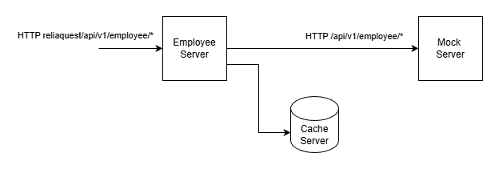
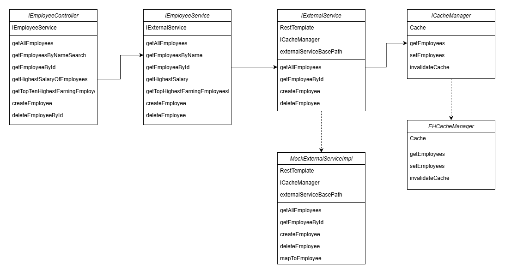

# Employee Microservice

This microservice is responsible for implementing employee-related APIs and interacts with a downstream mock service for fetching and persisting employee data.

---

## High Level Design

**Employee Server**  
Primary internet-exposed web server responsible for handling incoming client requests and executing business logic.

**Mock Server**  
Downstream microservice responsible for exposing APIs to fetch and persist employee data.

**Cache Server**  
In-memory or distributed cache used to improve performance by serving frequently accessed data without calling the downstream service.

In the current implementation, **EHCache** is used as an in-memory cache. For horizontal scaling, the cache layer can be replaced with a **Redis cluster** by introducing a `RedisCacheManager` implementation of the `ICacheManager` interface.

The service follows the **cache-aside pattern**, where data is first retrieved from the cache and, on a cache miss, fetched from the downstream service and stored in cache. Cache entries are invalidated on create and delete operations to maintain consistency with the downstream system. TTL-based eviction can be configured based on business requirements.

---

## Low Level Design

Above diagram shows class level interactions and abstractions/implementations.